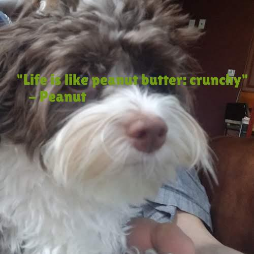

# MemeGenerator

## Overview:

- https://review.udacity.com/#!/rubrics/2709/view
- A "meme generator" written in Python 3.
- A multimedia application to dynamically generate memes, including an image with an overlaid quote.

- Quotes are loaded from a variety of filetypes (txt, csv...).
- Images are loaded from a folder of ready-made images
- Memes can be generated on the command line (passing an image path, quote body and quote author - all optional)
- Or using a Flask web app.

## Running the project:

Note: python3 -> 'py' for Windows

- To install:
                        
            > git clone https://github.com/jgrindall/udacity_python_project2.git
            > cd udacity_python_project2
            > python3 -m venv venv
            > source venv/Scripts/activate
            > pip install -r requirements.txt

- To run on the command line (from the root folder):

            > python3 src/meme.py
            > python3 src/meme.py --path='_data/photos/cat/cat_1.jpg'
            > python3 src/meme.py --body='This is the body' --author='Someone'
            > python3 src/meme.py --path='_data/photos/dog/scooby_1/scooby_1.png' --body='This is the body' --author='Someone'
            

- Lint (from the root folder):

            > pycodestyle src

- To run the web app (from the root folder):

            > export FLASK_APP=src/app.py
            > flask run

            

- To run some unit tests (currently just QuoteModel and Ingestor.py)

            > cd src
            > python3 -m doctest -v package/tests.txt

- To show some debug info (from the root folder):
            
            > python3 src/debug.py

## Code:

A brief description of the roles-and-responsibilities of all sub-modules including dependencies and examples 

of how to use the module.

- src/package/loaders

Helper functions to load images and quotes.

            - get_random_image()

            - get_random_quote()

            - get_all_images()
            Uses os.walk to find all files in the folder _data/photos or any subfolders, then memoized
            
            - get_all_quotes()
            Uses os.walk to find all files in the folder _data/DogQuotes, then ingested using the supported ingestors and then memoized

- src/package/meme_generator

            - class MemeCaptioner - handles adding a caption to an image with random color and position. Used by MemeEngine
            Eg.
            MemeCaptioner(img: PIL.Image).add_caption(quote: QuoteModel)
            
            - class MemeEngine - create a meme, given an image and a quote.
            Eg.
            MemeEngine().make_meme(img: PIL.Image, quote: QuoteModel)
            
- src/package/models

            - class QuoteModel - stores a quote (body, author). Also handles validation and has a factory method to create a model from a line of text
            Eg.
            q = QuoteModel("body", "author")
            q.is_valid() -> True
            q = QuoteModel.from_text('"I like cheese" - Someone')
            q = QuoteModel.from_text('I like cheese - Someone')

- src/package/quote_engine

            - abstract class IngestorInterface - a base class for all ingestors.
            The abstract import_and_parse method must be implemented in subclasses. Given a file path it loads the file and returns the Quotes inside.
            import_and_parse: (file: str) -> List[QuoteModel]
            
            The can_ingest method uses a list of file extensions to determine which parsers can operate on which files.
            
            - class Ingestor. Given a file path it will choose the correct ingestor to use, run 'import_and_parse' and return the Quotes inside the file
            Eg.
            quotes = Ingestor.parse("/something/something.csv")

            

- src/package/utils

            - Utility function 'get_tmp_file' which returns the path to a temp file
            
            
- src/package/app.py
            
            - Flask app.
            Uses the quote_engine module to load a random image and quote.
            Uses the meme_engine module to create a meme engine, which creates the meme.

- src/package/meme.py

            - Command line functionality.
            Builds an argparser. Runs MemeEngine::generate_meme.
            Captures errors and reports them nicely to the user

- src/package/tests.txt
            
            - Unit tests. To run them:
            
            > cd src/package
            > python3 -m doctest -v tests.txt
            
            
- src/package/errors

            - A number of custom error classes. Captured in meme.py.

For a complete demo see the attached [video](./assets/video.mp4)

